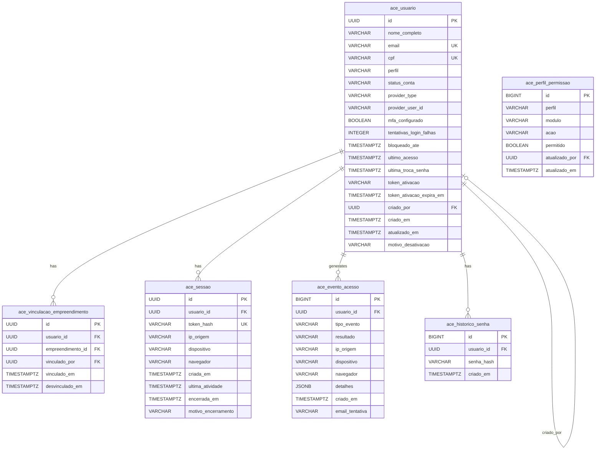

# ESPECIFICAÇÃO TÉCNICA DE IMPLEMENTAÇÃO

## Módulo ACE — Controle de Acesso

### Sistema de Gestão de Obras — Crédito Associativo — CDHU

| **Campo**              | **Valor**                                                                 |
|------------------------|---------------------------------------------------------------------------|
| **Módulo**             | ACE — Controle de Acesso                                                  |
| **Versão**             | 1.0                                                                       |
| **Data**               | Abril/2026                                                                |
| **Empresa**            | Prognum Informática                                                       |
| **Status**             | DRAFT — Para revisão técnica                                              |
| **Público**            | Equipe de Desenvolvimento (Victor, James) + Claude Code (agente)          |
| **Fonte (Análise)**    | EF_ACE v1.2 · UC_ACE v1.2 · Catálogo RN v7.1 (RN-ACE-01 a 12, RN-AUD-01) |
| **ADRs Aplicáveis**    | ADR-005 (Hexagonal) · ADR-006 (AP no Sistema) · ADR-007 (Cognito+OIDC) · ADR-008 (Rastreabilidade) |
| **Stack**              | Java 21 · Spring Boot 3.x · Spring Security 6.x · AWS Cognito · PostgreSQL 16 |

---

# 1. ARQUITETURA DO SISTEMA

## 1.1 Visão Geral da Arquitetura (ADR-005)

O módulo ACE segue a arquitetura hexagonal (Ports & Adapters) definida na ADR-005. O domínio é livre de dependências de framework. A infraestrutura encapsula Spring Security, AWS Cognito SDK e JPA.

```
modules/ace/
├── domain/
│   ├── model/                    # Entities e Value Objects
│   │   ├── Usuario.java
│   │   ├── Perfil.java           # Enum
│   │   ├── StatusConta.java      # Enum
│   │   ├── Sessao.java
│   │   ├── VinculacaoEmpreendimento.java
│   │   ├── HistoricoSenha.java
│   │   └── EventoAcesso.java
│   ├── service/                  # Domain Services
│   │   ├── PoliticaSenhaService.java
│   │   └── GestaoSessaoService.java
│   └── port/
│       ├── in/                   # Use Case interfaces
│       │   ├── CadastrarUsuarioUseCase.java       # UC-ACE-01
│       │   ├── AtivarContaUseCase.java            # UC-ACE-02
│       │   ├── RealizarLoginUseCase.java           # UC-ACE-03
│       │   ├── GerenciarPerfisUseCase.java         # UC-ACE-04
│       │   ├── DesativarUsuarioUseCase.java        # UC-ACE-05
│       │   ├── ResetarSenhaUseCase.java            # UC-ACE-06
│       │   └── EncerrarSessaoUseCase.java          # UC-ACE-07
│       └── out/                  # Repository e External Service interfaces
│           ├── UsuarioRepository.java
│           ├── SessaoRepository.java
│           ├── EventoAcessoRepository.java
│           ├── HistoricoSenhaRepository.java
│           ├── IdentityProviderPort.java           # Abstração sobre Cognito/SCCI
│           ├── EmailPort.java                      # Abstração sobre SES
│           └── AuditTrailPort.java                 # Porta para trilha imutável
├── application/
│   └── usecase/                  # Implementações dos Use Cases
│       ├── CadastrarUsuarioUseCaseImpl.java
│       ├── AtivarContaUseCaseImpl.java
│       ├── RealizarLoginUseCaseImpl.java
│       ├── GerenciarPerfisUseCaseImpl.java
│       ├── DesativarUsuarioUseCaseImpl.java
│       ├── ResetarSenhaUseCaseImpl.java
│       └── EncerrarSessaoUseCaseImpl.java
└── infrastructure/
    └── adapter/
        ├── in/
        │   └── web/              # REST Controllers
        │       ├── UsuarioController.java
        │       ├── AuthController.java
        │       └── SessaoController.java
        └── out/
            ├── persistence/      # JPA Repositories
            │   ├── UsuarioJpaRepository.java
            │   ├── SessaoJpaRepository.java
            │   ├── EventoAcessoJpaRepository.java
            │   ├── HistoricoSenhaJpaRepository.java
            │   └── entity/       # JPA Entities (mapeamento ORM)
            │       ├── UsuarioJpaEntity.java
            │       ├── SessaoJpaEntity.java
            │       ├── VinculacaoEmpreendimentoJpaEntity.java
            │       ├── EventoAcessoJpaEntity.java
            │       └── HistoricoSenhaJpaEntity.java
            ├── identity/         # AWS Cognito + SCCI adapters
            │   ├── CognitoIdentityProviderAdapter.java
            │   └── ScciIdentityProviderAdapter.java
            ├── email/            # AWS SES adapter
            │   └── SesEmailAdapter.java
            └── audit/            # Trilha imutável adapter
                └── AuditTrailAdapter.java
```

## 1.2 Decisão de Design: Dual Identity Provider (ADR-006, ADR-007)

O sistema opera com dois provedores de identidade conforme PV-21 (RESOLVIDA):

| **Tipo de Usuário** | **Provedor de Identidade** | **Protocolo** | **Source** |
|---|---|---|---|
| Interno (CDHU) | SCCI Prognum | OpenID Connect | RN-ACE-10, PV-21 |
| Externo (Agente Promotor) | AWS Cognito | OIDC nativo | RN-ACE-10, PV-21 |

A interface `IdentityProviderPort` abstrai ambos os provedores. O Spring Security resolve o provedor correto com base no domínio do e-mail ou em um atributo do token JWT (`provider_type`).

**Regra crítica:** O MFA (TOTP) é idêntico para ambos os provedores (PV-P04 RESOLVIDA). Ambos exigem e-mail + senha + código TOTP de 6 dígitos. Source: RN-ACE-04.

## 1.3 Separação de Responsabilidades: Sistema Local vs. Identity Provider

| **Responsabilidade** | **Onde vive** | **Justificativa** |
|---|---|---|
| Autenticação (senha + MFA) | Identity Provider (Cognito/SCCI) | ADR-007. Cognito gerencia ciclo de vida de credenciais nativamente. |
| Hash de senha, política de complexidade | Identity Provider | Cognito implementa política de senha nativamente. |
| Dados de perfil e vinculação | Banco local (PostgreSQL) | Dados de negócio que não pertencem ao IdP. |
| Sessões aplicativas | Banco local + Redis (futuro) | Controle de max 2 sessões simultâneas (RN-ACE-12). |
| Trilha de auditoria de acesso | Banco local (append-only) | RN-ACE-07, RN-AUD-01. Retenção 10 anos. |
| Status da conta (Ativa/Desativada) | Ambos (sincronizado) | Desativação bloqueia no IdP E no banco local (RN-ACE-09). |

---

# 2. MODELO DE DADOS

## 2.1 Catálogo de Entidades

| **Entidade** | **Tabela** | **Descrição** | **Módulo Owner** | **Referenciada por** |
|---|---|---|---|---|
| Usuário | `ace_usuario` | Registro de cada pessoa com acesso ao sistema | ACE | MED (ateste), APR (parecer), AUD (trilha), todos |
| Vinculação Empreendimento | `ace_vinculacao_empreendimento` | Associação N:M entre usuário e empreendimento | ACE | CAD, MED, CAL |
| Sessão | `ace_sessao` | Sessão ativa de um usuário | ACE | — |
| Evento de Acesso | `ace_evento_acesso` | Log imutável de autenticação | ACE/AUD | EXP (exportação trilha) |
| Histórico de Senha | `ace_historico_senha` | Hash das últimas 5 senhas (anti-reuso) | ACE | — |
| Perfil-Permissão | `ace_perfil_permissao` | Matriz de permissões por perfil × módulo × ação | ACE | Todos (verificação de acesso) |

## 2.2 Detalhamento das Entidades

### 2.2.1 Entidade: Usuario

**Tabela:** `ace_usuario`
**Descrição:** Registro central de cada pessoa com acesso ao sistema. Contém dados de identificação, perfil atribuído e status do ciclo de vida da conta.
**Source:** EF_ACE Seção 5.1, RN-ACE-01, RN-ACE-03, RN-ACE-09

| **Coluna** | **Tipo** | **Nullable** | **Default** | **Constraint** | **Source (RN/EF)** |
|---|---|---|---|---|---|
| `id` | `UUID` | NOT NULL | `gen_random_uuid()` | PK | — |
| `nome_completo` | `VARCHAR(255)` | NOT NULL | — | — | EF_ACE 5.1 |
| `email` | `VARCHAR(255)` | NOT NULL | — | UNIQUE | EF_ACE 5.1, V-ACE-01 |
| `cpf` | `VARCHAR(11)` | NOT NULL | — | UNIQUE, CHECK (length=11) | EF_ACE 5.1, V-ACE-02 |
| `perfil` | `VARCHAR(50)` | NOT NULL | — | CHECK (IN enum Perfil) | RN-ACE-01 |
| `status_conta` | `VARCHAR(30)` | NOT NULL | `'PENDENTE_ATIVACAO'` | CHECK (IN enum StatusConta) | RN-ACE-03, RN-ACE-09 |
| `provider_type` | `VARCHAR(20)` | NOT NULL | — | CHECK (IN ('COGNITO','SCCI')) | RN-ACE-10, PV-21 |
| `provider_user_id` | `VARCHAR(255)` | NULL | — | — | ID do usuário no Cognito/SCCI |
| `mfa_configurado` | `BOOLEAN` | NOT NULL | `FALSE` | — | RN-ACE-04, EF_ACE 5.1 |
| `tentativas_login_falhas` | `INTEGER` | NOT NULL | `0` | CHECK (>= 0) | RN-ACE-04 |
| `bloqueado_ate` | `TIMESTAMP WITH TIME ZONE` | NULL | — | — | RN-ACE-04 (bloqueio 30min) |
| `ultimo_acesso` | `TIMESTAMP WITH TIME ZONE` | NULL | — | — | EF_ACE 5.1 |
| `ultima_troca_senha` | `TIMESTAMP WITH TIME ZONE` | NULL | — | — | RN-ACE-08 (expiração 90 dias) |
| `token_ativacao` | `VARCHAR(255)` | NULL | — | — | RN-ACE-03 (link 72h) |
| `token_ativacao_expira_em` | `TIMESTAMP WITH TIME ZONE` | NULL | — | — | RN-ACE-03 |
| `criado_por` | `UUID` | NOT NULL | — | FK → ace_usuario(id) | RN-ACE-07 |
| `criado_em` | `TIMESTAMP WITH TIME ZONE` | NOT NULL | `NOW()` | IMMUTABLE after INSERT | EF_ACE 5.1 |
| `atualizado_em` | `TIMESTAMP WITH TIME ZONE` | NOT NULL | `NOW()` | — | — |
| `motivo_desativacao` | `VARCHAR(500)` | NULL | — | — | UC-ACE-05 (campo opcional) |

**Índices:**

| **Nome** | **Colunas** | **Tipo** | **Justificativa** |
|---|---|---|---|
| `idx_ace_usuario_email` | `email` | UNIQUE | Login lookup + validação V-ACE-01 |
| `idx_ace_usuario_cpf` | `cpf` | UNIQUE | Validação V-ACE-02 |
| `idx_ace_usuario_perfil` | `perfil` | B-TREE | Filtro de listagem UC-ACE-04 |
| `idx_ace_usuario_status` | `status_conta` | B-TREE | Filtro de listagem |
| `idx_ace_usuario_provider` | `provider_type, provider_user_id` | B-TREE | Lookup por token JWT |

**Constraints de imutabilidade:**
- `criado_em`: Enforced via trigger `BEFORE UPDATE` que impede alteração. Source: EF_ACE 5.1 "Timestamp imutável".
- `cpf`: Não pode ser alterado após criação. Enforced via application layer (`UsuarioService` rejeita update em CPF). Source: dado de identificação civil, implícito.
- Registros NUNCA são deletados (DELETE bloqueado via policy/trigger). Source: RN-ACE-09.

### 2.2.2 Entidade: VinculacaoEmpreendimento

**Tabela:** `ace_vinculacao_empreendimento`
**Descrição:** Associação entre um usuário e um empreendimento que ele pode acessar. Determina a visibilidade de dados no sistema.
**Source:** RN-ACE-06, EF_ACE Seção 5.1 "Empreendimentos vinculados"

| **Coluna** | **Tipo** | **Nullable** | **Default** | **Constraint** | **Source (RN/EF)** |
|---|---|---|---|---|---|
| `id` | `UUID` | NOT NULL | `gen_random_uuid()` | PK | — |
| `usuario_id` | `UUID` | NOT NULL | — | FK → ace_usuario(id) | RN-ACE-06 |
| `empreendimento_id` | `UUID` | NOT NULL | — | FK → cad_empreendimento(id) | RN-ACE-06 |
| `vinculado_por` | `UUID` | NOT NULL | — | FK → ace_usuario(id) | RN-ACE-07 |
| `vinculado_em` | `TIMESTAMP WITH TIME ZONE` | NOT NULL | `NOW()` | — | RN-ACE-07 |
| `desvinculado_em` | `TIMESTAMP WITH TIME ZONE` | NULL | — | — | Soft-delete para histórico |

**Índices:**

| **Nome** | **Colunas** | **Tipo** | **Justificativa** |
|---|---|---|---|
| `idx_ace_vinc_usuario` | `usuario_id` | B-TREE | Lookup de empreendimentos do usuário |
| `idx_ace_vinc_empreendimento` | `empreendimento_id` | B-TREE | Lookup de usuários do empreendimento |
| `uq_ace_vinc_ativo` | `usuario_id, empreendimento_id` WHERE `desvinculado_em IS NULL` | UNIQUE PARTIAL | Impede vinculação duplicada ativa |

**Regra de negócio:** Perfis Administrador e Superintendente NÃO possuem registros nesta tabela — têm visão global por design (RN-ACE-06). A verificação de acesso trata esses perfis como exceção no código.

### 2.2.3 Entidade: Sessao

**Tabela:** `ace_sessao`
**Descrição:** Representa uma sessão ativa de um usuário autenticado. O sistema limita a 2 sessões simultâneas por usuário.
**Source:** RN-ACE-12, EF_ACE Seção 5.2

| **Coluna** | **Tipo** | **Nullable** | **Default** | **Constraint** | **Source (RN/EF)** |
|---|---|---|---|---|---|
| `id` | `UUID` | NOT NULL | `gen_random_uuid()` | PK | — |
| `usuario_id` | `UUID` | NOT NULL | — | FK → ace_usuario(id) | RN-ACE-12 |
| `token_hash` | `VARCHAR(64)` | NOT NULL | — | UNIQUE | Hash SHA-256 do session token |
| `ip_origem` | `VARCHAR(45)` | NOT NULL | — | — | RN-ACE-07 (IPv4 ou IPv6) |
| `dispositivo` | `VARCHAR(255)` | NULL | — | — | RN-ACE-12, EF_ACE 5.2 |
| `navegador` | `VARCHAR(255)` | NULL | — | — | EF_ACE 5.2 |
| `criada_em` | `TIMESTAMP WITH TIME ZONE` | NOT NULL | `NOW()` | — | RN-ACE-07 |
| `ultima_atividade` | `TIMESTAMP WITH TIME ZONE` | NOT NULL | `NOW()` | — | RN-ACE-04 (timeout inatividade) |
| `encerrada_em` | `TIMESTAMP WITH TIME ZONE` | NULL | — | — | — |
| `motivo_encerramento` | `VARCHAR(50)` | NULL | — | CHECK (IN enum) | LOGOUT, EXPIRADA, ADMIN_REMOTO, NOVA_SESSAO, DESATIVACAO |

**Índices:**

| **Nome** | **Colunas** | **Tipo** | **Justificativa** |
|---|---|---|---|
| `idx_ace_sessao_usuario_ativa` | `usuario_id` WHERE `encerrada_em IS NULL` | B-TREE PARTIAL | Contagem de sessões ativas (max 2) |
| `idx_ace_sessao_token` | `token_hash` | UNIQUE | Lookup de sessão por token |
| `idx_ace_sessao_atividade` | `ultima_atividade` WHERE `encerrada_em IS NULL` | B-TREE PARTIAL | Job de expiração por inatividade |

### 2.2.4 Entidade: EventoAcesso

**Tabela:** `ace_evento_acesso`
**Descrição:** Log imutável (append-only) de todos os eventos de autenticação e acesso. Retenção mínima de 10 anos.
**Source:** RN-ACE-07, RN-AUD-01, EF_ACE Seção 5.2

| **Coluna** | **Tipo** | **Nullable** | **Default** | **Constraint** | **Source (RN/EF)** |
|---|---|---|---|---|---|
| `id` | `BIGINT` | NOT NULL | `GENERATED ALWAYS AS IDENTITY` | PK | — |
| `usuario_id` | `UUID` | NULL | — | FK → ace_usuario(id) | RN-ACE-07 (NULL para tentativas com e-mail desconhecido) |
| `tipo_evento` | `VARCHAR(50)` | NOT NULL | — | CHECK (IN enum TipoEventoAcesso) | RN-ACE-07 |
| `resultado` | `VARCHAR(20)` | NOT NULL | — | CHECK (IN ('SUCESSO','FALHA','BLOQUEIO')) | RN-ACE-07 |
| `ip_origem` | `VARCHAR(45)` | NOT NULL | — | — | RN-ACE-07 |
| `dispositivo` | `VARCHAR(255)` | NULL | — | — | RN-ACE-07 |
| `navegador` | `VARCHAR(255)` | NULL | — | — | RN-ACE-07 |
| `detalhes` | `JSONB` | NULL | — | — | Info adicional (perfil alterado de/para, etc.) |
| `criado_em` | `TIMESTAMP WITH TIME ZONE` | NOT NULL | `NOW()` | — | RN-ACE-07, RN-AUD-01 |
| `email_tentativa` | `VARCHAR(255)` | NULL | — | — | Para logins falhados com email desconhecido |

**Índices:**

| **Nome** | **Colunas** | **Tipo** | **Justificativa** |
|---|---|---|---|
| `idx_ace_evento_usuario` | `usuario_id, criado_em` | B-TREE | Consulta de trilha por usuário |
| `idx_ace_evento_tipo` | `tipo_evento, criado_em` | B-TREE | Filtro por tipo para relatórios |
| `idx_ace_evento_data` | `criado_em` | B-TREE | Filtro por período (RN-EXP-19) |

**Imutabilidade:** Tabela append-only. Enforced via:
1. Trigger `BEFORE UPDATE` → `RAISE EXCEPTION 'ace_evento_acesso is append-only'`
2. Trigger `BEFORE DELETE` → `RAISE EXCEPTION 'ace_evento_acesso does not allow deletes'`
3. GRANT: aplicação tem apenas `INSERT` e `SELECT`, sem `UPDATE`/`DELETE`.
Source: RN-AUD-01.

### 2.2.5 Entidade: HistoricoSenha

**Tabela:** `ace_historico_senha`
**Descrição:** Armazena hashes das últimas N senhas para impedir reutilização.
**Source:** RN-ACE-08 "Sem reutilizar 5 últimas"

| **Coluna** | **Tipo** | **Nullable** | **Default** | **Constraint** | **Source (RN/EF)** |
|---|---|---|---|---|---|
| `id` | `BIGINT` | NOT NULL | `GENERATED ALWAYS AS IDENTITY` | PK | — |
| `usuario_id` | `UUID` | NOT NULL | — | FK → ace_usuario(id) | RN-ACE-08 |
| `senha_hash` | `VARCHAR(255)` | NOT NULL | — | — | BCrypt hash |
| `criado_em` | `TIMESTAMP WITH TIME ZONE` | NOT NULL | `NOW()` | — | — |

**Índice:**

| **Nome** | **Colunas** | **Tipo** | **Justificativa** |
|---|---|---|---|
| `idx_ace_hist_senha_usuario` | `usuario_id, criado_em DESC` | B-TREE | Busca das 5 últimas senhas |

**Nota:** O hash é armazenado localmente mesmo com autenticação delegada ao Cognito/SCCI, porque a regra de anti-reuso (RN-ACE-08) é de negócio e precisa ser validada pelo sistema antes de enviar a nova senha ao IdP.

### 2.2.6 Entidade: PerfilPermissao

**Tabela:** `ace_perfil_permissao`
**Descrição:** Matriz de permissões configuráveis por perfil, módulo e ação. O Administrador pode ajustar esta matriz.
**Source:** RN-ACE-02

| **Coluna** | **Tipo** | **Nullable** | **Default** | **Constraint** | **Source (RN/EF)** |
|---|---|---|---|---|---|
| `id` | `BIGINT` | NOT NULL | `GENERATED ALWAYS AS IDENTITY` | PK | — |
| `perfil` | `VARCHAR(50)` | NOT NULL | — | CHECK (IN enum Perfil) | RN-ACE-01 |
| `modulo` | `VARCHAR(10)` | NOT NULL | — | CHECK (IN enum Modulo) | RN-ACE-02 |
| `acao` | `VARCHAR(20)` | NOT NULL | — | CHECK (IN enum Acao) | RN-ACE-02 |
| `permitido` | `BOOLEAN` | NOT NULL | `FALSE` | — | RN-ACE-02 |
| `atualizado_por` | `UUID` | NULL | — | FK → ace_usuario(id) | RN-AUD-01 |
| `atualizado_em` | `TIMESTAMP WITH TIME ZONE` | NOT NULL | `NOW()` | — | — |

**Unique Constraint:**

| **Nome** | **Colunas** | **Source (RN)** |
|---|---|---|
| `uq_ace_perfil_permissao` | `perfil, modulo, acao` | RN-ACE-02 |

## 2.3 Enumerações

| **Enum Name** | **Values** | **Source (RN)** | **Usado em** |
|---|---|---|---|
| `Perfil` | `ADMINISTRADOR`, `ANALISTA_FINANCEIRO`, `ANALISTA_FINANCEIRO_SENIOR`, `ENGENHEIRO_MEDICAO`, `DIRETOR_FINANCEIRO`, `SUPERINTENDENTE_FOMENTO`, `AGENTE_PROMOTOR`, `TESOURARIA` | RN-ACE-01 | `ace_usuario.perfil`, `ace_perfil_permissao.perfil` |
| `StatusConta` | `PENDENTE_ATIVACAO`, `ATIVA`, `DESATIVADA`, `BLOQUEADA` | RN-ACE-03, RN-ACE-09, RN-ACE-04 | `ace_usuario.status_conta` |
| `ProviderType` | `COGNITO`, `SCCI` | RN-ACE-10, PV-21 | `ace_usuario.provider_type` |
| `TipoEventoAcesso` | `LOGIN`, `LOGOUT`, `FALHA_LOGIN`, `BLOQUEIO_CONTA`, `DESBLOQUEIO_CONTA`, `RESET_SENHA`, `TROCA_SENHA`, `ALTERACAO_PERFIL`, `ATIVACAO_CONTA`, `DESATIVACAO_CONTA`, `REATIVACAO_CONTA`, `CRIACAO_USUARIO`, `ALTERACAO_VINCULACAO`, `ENCERRAMENTO_SESSAO`, `CONFIGURACAO_MFA` | RN-ACE-07 | `ace_evento_acesso.tipo_evento` |
| `MotivoEncerramento` | `LOGOUT`, `EXPIRADA`, `ADMIN_REMOTO`, `NOVA_SESSAO`, `DESATIVACAO` | RN-ACE-12 | `ace_sessao.motivo_encerramento` |
| `Modulo` | `CAD`, `MED`, `CAL`, `APR`, `EXP`, `ACE` | RN-ACE-02 | `ace_perfil_permissao.modulo` |
| `Acao` | `VISUALIZAR`, `CRIAR`, `EDITAR`, `APROVAR`, `EXPORTAR` | RN-ACE-02 | `ace_perfil_permissao.acao` |

## 2.4 Relacionamentos

```
ace_usuario 1──N ace_vinculacao_empreendimento  via vinculacao.usuario_id
  Business rule: RN-ACE-06 (cada usuário vinculado a empreendimentos)
  Cascade: RESTRICT (não pode deletar usuário com vinculações)
  Justificativa: Engenheiros são vinculados às obras que fiscalizam

ace_usuario 1──N ace_sessao  via sessao.usuario_id
  Business rule: RN-ACE-12 (máximo 2 sessões ativas)
  Cascade: RESTRICT
  Justificativa: Controle de sessões simultâneas

ace_usuario 1──N ace_evento_acesso  via evento.usuario_id
  Business rule: RN-ACE-07, RN-AUD-01
  Cascade: RESTRICT (eventos nunca deletados)
  Justificativa: Trilha imutável de 10 anos

ace_usuario 1──N ace_historico_senha  via historico.usuario_id
  Business rule: RN-ACE-08
  Cascade: RESTRICT
  Justificativa: Anti-reuso de senhas

ace_vinculacao_empreendimento N──1 cad_empreendimento  via vinculacao.empreendimento_id
  Business rule: RN-ACE-06
  Cascade: RESTRICT (empreendimento não pode ser deletado com vinculações)
  Justificativa: Vinculação depende de empreendimento existente no M1

ace_usuario (criado_por) N──1 ace_usuario  via usuario.criado_por
  Business rule: RN-ACE-03 (provisioning pelo Administrador)
  Cascade: RESTRICT
  Justificativa: Rastreabilidade de quem criou o usuário
```

## 2.5 Diagrama ER (Mermaid)



---

# 3. ESPECIFICAÇÃO DE API

## 3.1 Convenções Gerais

- Base path: `/api/v1`
- Auth: `Authorization: Bearer {JWT}` (obtido via Cognito/SCCI)
- Content-Type: `application/json`
- Timestamps: ISO 8601 com timezone (`2026-04-01T14:30:00-03:00`)
- IDs: UUID v4
- Paginação: `?page=0&size=20&sort=criado_em,desc`
- Erros seguem RFC 7807 (Problem Details)

## 3.2 UC-ACE-01 → Cadastrar Novo Usuário

### `POST /api/v1/usuarios`

**Descrição:** Cria um novo usuário no sistema com perfil e empreendimentos vinculados. Envia e-mail de ativação.
**Source:** UC-ACE-01, EF_ACE Seção 6.1
**Actor:** Administrador (RN-ACE-03: exclusivo da Gerência de Fomento — PV-22 RESOLVIDA)
**Permission:** ACE → CRIAR

**Request Body:**
```json
{
  "nome_completo": "string",       // Obrigatório. Max 255 chars.
  "email": "string",               // Obrigatório. Formato e-mail. Único no sistema. V-ACE-01
  "cpf": "string",                 // Obrigatório. 11 dígitos numéricos. Validação mod 11. V-ACE-02
  "perfil": "string",              // Obrigatório. Enum Perfil (8 valores). RN-ACE-01
  "empreendimento_ids": ["UUID"]   // Condicional: obrigatório para perfis que exigem vinculação. RN-ACE-06
}
```

**Regras de vinculação (Source: RN-ACE-06, UC-ACE-01 passo 4-5):**
- Perfis que EXIGEM `empreendimento_ids` com ao menos 1 elemento: `ENGENHEIRO_MEDICAO`, `ANALISTA_FINANCEIRO`, `ANALISTA_FINANCEIRO_SENIOR`, `AGENTE_PROMOTOR`, `TESOURARIA`
- Perfis que NÃO exigem (visão global): `ADMINISTRADOR`, `SUPERINTENDENTE_FOMENTO`, `DIRETOR_FINANCEIRO`

**Response 201 Created:**
```json
{
  "id": "UUID",
  "nome_completo": "string",
  "email": "string",
  "cpf": "string",
  "perfil": "string",
  "status_conta": "PENDENTE_ATIVACAO",
  "empreendimento_ids": ["UUID"],
  "criado_em": "ISO 8601",
  "criado_por": "UUID"
}
```

**Erros:**

| **HTTP** | **Código Erro** | **Mensagem** | **Source** |
|---|---|---|---|
| 400 | `V-ACE-01` | "E-mail [X] já cadastrado para o usuário [Nome]." | UC-ACE-01 3a |
| 400 | `V-ACE-02` | "CPF inválido. Verifique os dígitos." | UC-ACE-01 3b |
| 400 | `VINCULACAO_OBRIGATORIA` | "Perfil [X] exige vinculação a pelo menos 1 empreendimento." | RN-ACE-06 |
| 400 | `PERFIL_INVALIDO` | "Perfil inválido. Valores aceitos: [lista]." | RN-ACE-01 |
| 400 | `EMPREENDIMENTO_NAO_ENCONTRADO` | "Empreendimento [ID] não encontrado." | RN-ACE-06 |
| 403 | `ACESSO_NEGADO` | "Você não tem permissão para criar usuários." | RN-ACE-02, RN-ACE-03 |
| 500 | `ERRO_ENVIO_EMAIL` | "Falha ao enviar e-mail de ativação. Tente reenviar." | UC-ACE-01 7a |

**Business Rules Applied:**
- **RN-ACE-03:** Somente Administrador cria usuários. Validado via Spring Security `@PreAuthorize`.
- **RN-ACE-01:** Perfil é um dos 8 predefinidos. Validado via enum check.
- **RN-ACE-06:** Vinculação condicional conforme perfil.
- **RN-ACE-07 / RN-AUD-01:** Evento `CRIACAO_USUARIO` registrado na trilha com detalhes (perfil, empreendimentos).
- **V-ACE-01:** E-mail único. Verificado via `SELECT` antes do `INSERT` + constraint UNIQUE.
- **V-ACE-02:** CPF validado por dígito verificador (mod 11) na application layer.

### `POST /api/v1/usuarios/{id}/reenviar-ativacao`

**Descrição:** Reenvia o e-mail de ativação para um usuário com status PENDENTE_ATIVACAO. Gera novo token com validade de 72h.
**Source:** UC-ACE-01 passo 7a (reenvio manual)
**Actor:** Administrador
**Permission:** ACE → EDITAR

**Response 200:**
```json
{
  "message": "E-mail de ativação reenviado.",
  "expira_em": "ISO 8601"
}
```

**Erros:**

| **HTTP** | **Código Erro** | **Mensagem** |
|---|---|---|
| 400 | `STATUS_INVALIDO` | "Reenvio só é possível para contas com status PENDENTE_ATIVACAO." |
| 404 | `USUARIO_NAO_ENCONTRADO` | "Usuário não encontrado." |

---

## 3.3 UC-ACE-02 → Ativar Conta e Configurar MFA

### `POST /api/v1/auth/ativar-conta`

**Descrição:** Ativa a conta criada pelo Administrador. Define senha e inicia fluxo de configuração MFA.
**Source:** UC-ACE-02, EF_ACE Seção 6.2
**Actor:** Novo Usuário (não autenticado — acesso via token de ativação)
**Permission:** Público (validado via token)

**Request Body:**
```json
{
  "token": "string",          // Token de ativação recebido por e-mail
  "senha": "string",          // Nova senha. Validar: RN-ACE-08. V-ACE-03
  "confirmar_senha": "string" // Deve ser idêntica à senha
}
```

**Response 200:**
```json
{
  "mfa_setup": {
    "qr_code_uri": "string",      // otpauth:// URI para escanear no app autenticador
    "secret": "string",            // Chave secreta (base32) para input manual
    "recovery_codes": ["string"]   // Códigos de recuperação (opcional, a definir)
  }
}
```

**Erros:**

| **HTTP** | **Código Erro** | **Mensagem** | **Source** |
|---|---|---|---|
| 400 | `V-ACE-04` | "Link expirado. Solicite ao Administrador um novo envio." | UC-ACE-02 2a |
| 400 | `V-ACE-03` | "Senha deve ter 12+ caracteres com maiúscula, minúscula, número e especial." | UC-ACE-02 5a |
| 400 | `SENHA_REUTILIZADA` | "Esta senha já foi utilizada recentemente." | UC-ACE-02 5b, RN-ACE-08 |
| 400 | `TOKEN_INVALIDO` | "Token de ativação inválido." | — |
| 400 | `SENHAS_DIFERENTES` | "Senhas não conferem." | — |

### `POST /api/v1/auth/confirmar-mfa`

**Descrição:** Confirma a configuração do MFA validando o primeiro código TOTP.
**Source:** UC-ACE-02 passos 8-9
**Actor:** Novo Usuário (autenticado parcialmente via token de ativação)

**Request Body:**
```json
{
  "token": "string",       // Token de ativação (ainda válido)
  "codigo_totp": "string"  // Código TOTP de 6 dígitos do app autenticador
}
```

**Response 200:**
```json
{
  "status": "ATIVA",
  "mensagem": "Conta ativada com sucesso. MFA configurado.",
  "redirect_url": "/dashboard"
}
```

**Erros:**

| **HTTP** | **Código Erro** | **Mensagem** | **Source** |
|---|---|---|---|
| 400 | `V-ACE-05` | "Código incorreto. Verifique seu aplicativo autenticador." | UC-ACE-02 8a |

---

## 3.4 UC-ACE-03 → Realizar Login com MFA

**Nota de implementação:** O login é delegado ao Identity Provider (Cognito ou SCCI) via OIDC. O backend NÃO recebe a senha diretamente — o frontend redireciona para o IdP, que retorna um authorization code. O backend troca o code por tokens JWT.

No entanto, as regras de negócio de bloqueio (5 falhas → 30min), controle de sessões (max 2), e registro de trilha são responsabilidade do backend.

### `POST /api/v1/auth/callback`

**Descrição:** Callback OAuth2/OIDC. Recebe o authorization code do IdP, troca por tokens, aplica regras de sessão e retorna JWT aplicativo.
**Source:** UC-ACE-03, EF_ACE Seção 6.3
**Actor:** Qualquer usuário
**Permission:** Público

**Request Body:**
```json
{
  "code": "string",           // Authorization code do IdP
  "redirect_uri": "string",   // URI de callback
  "provider": "COGNITO|SCCI"  // Qual IdP foi usado
}
```

**Response 200:**
```json
{
  "access_token": "string",
  "refresh_token": "string",
  "expires_in": 28800,            // Timeout configurável (RN-ACE-04, padrão 8h)
  "usuario": {
    "id": "UUID",
    "nome_completo": "string",
    "perfil": "string",
    "empreendimento_ids": ["UUID"]
  }
}
```

**Erros:**

| **HTTP** | **Código Erro** | **Mensagem** | **Source** |
|---|---|---|---|
| 401 | `CREDENCIAIS_INVALIDAS` | "E-mail ou senha incorretos." | UC-ACE-03 2a |
| 403 | `V-ACE-06` | "Conta bloqueada. Aguarde 30 minutos ou contate o Administrador." | UC-ACE-03 2b |
| 403 | `CONTA_DESATIVADA` | "Conta desativada. Contate o Administrador." | UC-ACE-03 2c |
| 403 | `SENHA_EXPIRADA` | "Sua senha expirou. Defina uma nova." | UC-ACE-03 2d, V-ACE-10 |

**Business Rules Applied:**
- **RN-ACE-04:** Após 5 falhas consecutivas → bloqueia 30 minutos. Contagem gerenciada no banco local (`tentativas_login_falhas`).
- **RN-ACE-12:** Se o usuário já tem 2 sessões ativas, a mais antiga é encerrada (com `motivo_encerramento = 'NOVA_SESSAO'`).
- **RN-ACE-07:** Evento LOGIN registrado na trilha com IP, dispositivo, navegador.
- **RN-ACE-08:** Se `ultima_troca_senha + 90 dias < NOW()` → redirect para troca obrigatória.

### `POST /api/v1/auth/logout`

**Descrição:** Encerra a sessão atual do usuário.
**Source:** UC-ACE-03 (implícito), RN-ACE-07
**Actor:** Qualquer usuário autenticado

**Response 200:**
```json
{
  "mensagem": "Sessão encerrada."
}
```

---

## 3.5 UC-ACE-04 → Gerenciar Perfis e Vinculações

### `GET /api/v1/usuarios`

**Descrição:** Lista todos os usuários com filtros. Paginado.
**Source:** UC-ACE-04 passo 1, EF_ACE Seção 6.4
**Actor:** Administrador
**Permission:** ACE → VISUALIZAR

**Query Params:**
```
?page=0&size=20
&nome=string           // Filtro por nome (ILIKE)
&email=string          // Filtro por e-mail (ILIKE)
&perfil=ENGENHEIRO_MEDICAO  // Filtro por perfil
&status=ATIVA          // Filtro por status
&empreendimento_id=UUID // Filtro por empreendimento vinculado
&sort=nome_completo,asc
```

**Response 200:**
```json
{
  "content": [
    {
      "id": "UUID",
      "nome_completo": "string",
      "email": "string",
      "perfil": "string",
      "status_conta": "string",
      "ultimo_acesso": "ISO 8601",
      "empreendimentos_count": 3,
      "criado_em": "ISO 8601"
    }
  ],
  "page": { "number": 0, "size": 20, "totalElements": 42, "totalPages": 3 }
}
```

### `GET /api/v1/usuarios/{id}`

**Descrição:** Retorna dados completos de um usuário, incluindo empreendimentos vinculados.
**Source:** UC-ACE-04 passo 2
**Actor:** Administrador
**Permission:** ACE → VISUALIZAR

**Response 200:**
```json
{
  "id": "UUID",
  "nome_completo": "string",
  "email": "string",
  "cpf": "string",
  "perfil": "string",
  "status_conta": "string",
  "provider_type": "string",
  "mfa_configurado": true,
  "ultimo_acesso": "ISO 8601",
  "ultima_troca_senha": "ISO 8601",
  "criado_em": "ISO 8601",
  "criado_por": { "id": "UUID", "nome_completo": "string" },
  "empreendimentos": [
    { "id": "UUID", "nome": "string", "codigo": "string", "vinculado_em": "ISO 8601" }
  ]
}
```

### `PUT /api/v1/usuarios/{id}`

**Descrição:** Altera perfil e/ou vinculações de um usuário.
**Source:** UC-ACE-04 passos 3-7
**Actor:** Administrador
**Permission:** ACE → EDITAR

**Request Body:**
```json
{
  "perfil": "string",              // Novo perfil (opcional, manter se não informado)
  "empreendimento_ids": ["UUID"]   // Nova lista de empreendimentos (substitui a anterior)
}
```

**Response 200:**
```json
{
  "id": "UUID",
  "perfil": "string",
  "empreendimento_ids": ["UUID"],
  "atualizado_em": "ISO 8601"
}
```

**Erros:**

| **HTTP** | **Código Erro** | **Mensagem** | **Source** |
|---|---|---|---|
| 400 | `VINCULACAO_OBRIGATORIA` | "Perfil [X] exige vinculação a pelo menos 1 empreendimento." | UC-ACE-04 3a |

**Business Rules Applied:**
- **RN-ACE-07 / RN-AUD-01:** Evento `ALTERACAO_PERFIL` registrado com detalhes de antes/depois (perfil anterior, empreendimentos adicionados/removidos).
- **RN-ACE-11:** Validação de menor privilégio — o sistema não permite acumular permissões de perfis (cada usuário tem 1 perfil). Usuário com 2 funções precisa de 2 contas.
- **RN-ACE-02:** Efeito imediato no próximo acesso (UC-ACE-04 passo 7). O token JWT contém o perfil — na próxima autenticação, o novo perfil é refletido.

---

## 3.6 UC-ACE-05 → Desativar Usuário

### `POST /api/v1/usuarios/{id}/desativar`

**Descrição:** Desativa a conta de um usuário. Bloqueia login. Encerra sessões ativas.
**Source:** UC-ACE-05, EF_ACE Seção 6.5
**Actor:** Administrador
**Permission:** ACE → EDITAR

**Request Body:**
```json
{
  "motivo": "string"  // Opcional. Max 500 chars. Source: UC-ACE-05 passo 7
}
```

**Response 200:**
```json
{
  "id": "UUID",
  "status_conta": "DESATIVADA",
  "sessoes_encerradas": 2,
  "mensagem": "Conta desativada. 2 sessão(ões) encerrada(s)."
}
```

**Business Rules Applied:**
- **RN-ACE-09:** Conta bloqueada, registros preservados. Nunca exclusão.
- **RN-ACE-12:** Sessões ativas encerradas imediatamente (motivo = `DESATIVACAO`).
- **RN-ACE-07:** Evento `DESATIVACAO_CONTA` registrado.
- Desativa também no Identity Provider (Cognito `AdminDisableUser` / SCCI API equivalente).

### `POST /api/v1/usuarios/{id}/reativar`

**Descrição:** Reativa uma conta desativada. O usuário mantém perfil e vinculações anteriores.
**Source:** UC-ACE-05 nota final
**Actor:** Administrador
**Permission:** ACE → EDITAR

**Response 200:**
```json
{
  "id": "UUID",
  "status_conta": "ATIVA",
  "mensagem": "Conta reativada."
}
```

---

## 3.7 UC-ACE-06 → Resetar Senha

### `POST /api/v1/auth/alterar-senha` (Self-service)

**Descrição:** O próprio usuário altera sua senha. Requer senha atual e código TOTP.
**Source:** UC-ACE-06, EF_ACE Seção 6.6, passo 1
**Actor:** Qualquer usuário autenticado

**Request Body:**
```json
{
  "senha_atual": "string",
  "nova_senha": "string",
  "confirmar_nova_senha": "string",
  "codigo_totp": "string"         // Confirmação de identidade. Source: UC-ACE-06 passo 4
}
```

**Response 200:**
```json
{
  "mensagem": "Senha alterada com sucesso."
}
```

**Erros:**

| **HTTP** | **Código Erro** | **Mensagem** | **Source** |
|---|---|---|---|
| 400 | `SENHA_ATUAL_INCORRETA` | "Senha atual incorreta." | UC-ACE-06 1a |
| 400 | `V-ACE-03` | "Senha deve ter 12+ caracteres com maiúscula, minúscula, número e especial." | UC-ACE-06 3a |
| 400 | `SENHA_REUTILIZADA` | "Esta senha já foi utilizada recentemente." | UC-ACE-06 3b, RN-ACE-08 |
| 400 | `V-ACE-05` | "Código incorreto." | RN-ACE-04 |

### `POST /api/v1/usuarios/{id}/forcar-reset-senha` (Administrador)

**Descrição:** O Administrador força um reset de senha. O sistema envia e-mail ao usuário com link de redefinição.
**Source:** UC-ACE-06, EF_ACE Seção 6.6, passo 2
**Actor:** Administrador
**Permission:** ACE → EDITAR

**Response 200:**
```json
{
  "mensagem": "E-mail de redefinição de senha enviado para [email_mascarado]."
}
```

---

## 3.8 UC-ACE-07 → Encerrar Sessão Remotamente

### `GET /api/v1/usuarios/{id}/sessoes`

**Descrição:** Lista sessões ativas de um usuário.
**Source:** UC-ACE-07 passo 2
**Actor:** Administrador
**Permission:** ACE → VISUALIZAR

**Response 200:**
```json
{
  "sessoes": [
    {
      "id": "UUID",
      "dispositivo": "string",
      "navegador": "string",
      "ip_origem": "string",
      "criada_em": "ISO 8601",
      "ultima_atividade": "ISO 8601",
      "duracao": "string"       // Human-readable: "2h 15min"
    }
  ]
}
```

### `DELETE /api/v1/usuarios/{usuario_id}/sessoes/{sessao_id}`

**Descrição:** Encerra uma sessão ativa de um usuário.
**Source:** UC-ACE-07 passos 3-5
**Actor:** Administrador
**Permission:** ACE → EDITAR

**Response 200:**
```json
{
  "mensagem": "Sessão encerrada.",
  "sessao_id": "UUID"
}
```

### `DELETE /api/v1/usuarios/{usuario_id}/sessoes`

**Descrição:** Encerra TODAS as sessões ativas de um usuário.
**Source:** UC-ACE-07 (variação prática)
**Actor:** Administrador
**Permission:** ACE → EDITAR

**Response 200:**
```json
{
  "mensagem": "2 sessão(ões) encerrada(s).",
  "sessoes_encerradas": 2
}
```

---

## 3.9 Endpoints Adicionais (Suporte Operacional)

### `GET /api/v1/usuarios/me`

**Descrição:** Retorna dados do usuário autenticado (perfil, empreendimentos, permissões).
**Actor:** Qualquer usuário autenticado

**Response 200:**
```json
{
  "id": "UUID",
  "nome_completo": "string",
  "perfil": "string",
  "empreendimentos": [{ "id": "UUID", "nome": "string" }],
  "permissoes": [
    { "modulo": "CAD", "acoes": ["VISUALIZAR", "CRIAR", "EDITAR"] },
    { "modulo": "MED", "acoes": ["VISUALIZAR"] }
  ]
}
```

### `GET /api/v1/ace/perfis`

**Descrição:** Lista os 8 perfis com suas permissões configuradas.
**Source:** RN-ACE-01, RN-ACE-02
**Actor:** Administrador

### `PUT /api/v1/ace/perfis/{perfil}/permissoes`

**Descrição:** Atualiza a matriz de permissões de um perfil.
**Source:** RN-ACE-02
**Actor:** Administrador
**Permission:** ACE → EDITAR

---

# 4. MAPA DE IMPLEMENTAÇÃO DE REGRAS DE NEGÓCIO

Para cada regra de negócio do módulo ACE, especificação exata de ONDE e COMO é enforced.

| **Regra** | **Nome** | **Camada de Enforcement** | **Mecanismo** | **Detalhes de Implementação** |
|---|---|---|---|---|
| **RN-ACE-01** | Perfis de Acesso | Database + Application | CHECK constraint na coluna `perfil` + enum Java `Perfil` | Enum com 8 valores fixos. O banco rejeita qualquer valor fora do enum. A aplicação usa o enum para type-safety. Perfis NÃO podem ser criados — constraint é estática. |
| **RN-ACE-02** | Matriz de Permissões | Database + Security Filter | Tabela `ace_perfil_permissao` + `PermissionEvaluator` no Spring Security | Custom `PermissionEvaluator` que faz lookup na tabela para `@PreAuthorize("hasPermission('CAD', 'VISUALIZAR')")`. Alterações na matriz registradas na trilha (RN-AUD-01). |
| **RN-ACE-03** | Provisioning pelo Administrador | Application + Security | `@PreAuthorize("hasRole('ADMINISTRADOR')")` no endpoint `POST /usuarios` | Somente ADMINISTRADOR pode acessar. E-mail de ativação com token UUID + expiração 72h. Token armazenado hasheado no banco. |
| **RN-ACE-04** | MFA Obrigatório | Identity Provider + Application | Cognito MFA policy (TOTP) + verificação local de `mfa_configurado` | Login bloqueado se `mfa_configurado = false`. Bloqueio após 5 falhas: `tentativas_login_falhas` incrementado no callback de falha do IdP. Desbloqueio automático após 30 min via check `bloqueado_ate < NOW()`. Timeout de inatividade configurável (1h–24h, padrão 8h) via parâmetro `ace.session.timeout-minutes` em tabela de configuração. |
| **RN-ACE-05** | Segregação Interno × Externo | Application + Query | Filtro global (`@Where` ou Specification JPA) baseado em `provider_type` + `perfil` | APs (`AGENTE_PROMOTOR`) só visualizam seus empreendimentos vinculados. Filtro aplicado em todas as queries de MED, CAD (somente leitura). O AP NUNCA vê valores de cálculo, pareceres ou dados de outros APs. Implemented via `EmpreendimentoSecurityFilter` que injeta `WHERE empreendimento_id IN (SELECT ... FROM ace_vinculacao_empreendimento WHERE usuario_id = :current_user)`. |
| **RN-ACE-06** | Vinculação Usuário-Empreendimento | Database + Application | Tabela `ace_vinculacao_empreendimento` + validation no `CadastrarUsuarioUseCaseImpl` | Validação: perfis que exigem vinculação devem ter ≥1 empreendimento. Exceção: `ADMINISTRADOR` e `SUPERINTENDENTE_FOMENTO` → visão global (sem registros na tabela de vinculação — tratados como exceção no filter). |
| **RN-ACE-07** | Log de Acesso na Trilha | Database (append-only) + Application | `AuditTrailAdapter` insere em `ace_evento_acesso` + triggers impedem UPDATE/DELETE | Cada evento de autenticação gera registro com timestamp, IP, dispositivo, resultado. Implementado como `@Async` para não bloquear o fluxo principal. Retenção 10 anos — sem purge automático. |
| **RN-ACE-08** | Política de Senhas | Application + Identity Provider | `PoliticaSenhaService` (domain service) + Cognito password policy | Validação local ANTES de enviar ao IdP: 12+ chars, maiúscula, minúscula, número, especial. Anti-reuso: compara hash BCrypt da nova senha com as 5 últimas em `ace_historico_senha`. Expiração 90 dias: verificação em cada login (`ultima_troca_senha + 90d < NOW()` → redirect forçado). |
| **RN-ACE-09** | Desativação sem Exclusão | Database + Application | Soft-delete via status `DESATIVADA` + GRANT sem DELETE + trigger anti-DELETE | Nenhum `DELETE FROM ace_usuario` é possível. Desativação: altera `status_conta` para `DESATIVADA`, desabilita no IdP. Registros históricos preservados (FK de medições, aprovações apontam para o `ace_usuario.id` que nunca é removido). |
| **RN-ACE-10** | Acesso do AP ao Sistema | Application + Identity Provider | Routing por `provider_type` no `IdentityProviderPort` | AP cadastrado com `provider_type = 'COGNITO'`. Internos com `provider_type = 'SCCI'`. O `IdentityProviderPort` despacha para o adapter correto. AP vinculado ao CNPJ da incorporadora (armazenado em `cad_empreendimento`). |
| **RN-ACE-11** | Menor Privilégio | Application | Validação no `GerenciarPerfisUseCaseImpl` | Cada usuário tem exatamente 1 perfil. Se a pessoa exerce 2 funções (ex: Lucimar = Superintendente + Administrador), tem 2 contas com e-mails distintos ou um mecanismo de "perfil ativo" (selecionável via menu). **ANÁLISE INSUFICIENTE:** A EF_ACE menciona "perfis alternáveis via menu" (RN-ACE-11 exemplo), mas não detalha o mecanismo. Implementação proposta: coluna `perfil_ativo` na sessão, switchable via endpoint `POST /api/v1/auth/trocar-perfil`. TODO: Validar com PO se esta abordagem é correta. |
| **RN-ACE-12** | Gestão de Sessões | Database + Application | Contagem de sessões ativas por `usuario_id` + eviction da mais antiga | No login, `GestaoSessaoService` conta sessões ativas (`encerrada_em IS NULL`). Se ≥ 2, encerra a mais antiga (menor `criada_em`) com `motivo_encerramento = 'NOVA_SESSAO'`. Administrador encerra remotamente via `DELETE /sessoes/{id}`. |
| **RN-AUD-01** | Trilha Imutável | Database (triggers + GRANT) | Triggers BEFORE UPDATE/DELETE em `ace_evento_acesso` que rejeitam a operação | Append-only table. A aplicação tem GRANT apenas INSERT + SELECT. Trigger rejeita qualquer UPDATE ou DELETE com mensagem de erro. Retenção 10 anos — sem job de cleanup. |

---

# 5. MÁQUINAS DE ESTADO

## 5.1 StatusConta — Ciclo de Vida do Usuário

**Source:** RN-ACE-03, RN-ACE-04, RN-ACE-09, UC-ACE-01 a UC-ACE-05

```
                 ┌─────────────────────┐
     UC-ACE-01   │                     │
     Cadastro ──▶│  PENDENTE_ATIVACAO  │
                 │                     │
                 └──────────┬──────────┘
                            │
                   UC-ACE-02│ Ativação + MFA
                            │
                            ▼
                 ┌─────────────────────┐
                 │                     │◄──────────── UC-ACE-05 (Reativar)
                 │       ATIVA         │
                 │                     │──────┐
                 └──────────┬──────────┘      │
                            │                 │ 5 falhas de login
                   UC-ACE-05│ Desativar       │ (RN-ACE-04)
                            │                 ▼
                            │      ┌─────────────────────┐
                            │      │                     │
                            │      │     BLOQUEADA        │
                            │      │  (auto: 30 min)     │
                            │      │                     │
                            │      └──────────┬──────────┘
                            │                 │
                            │                 │ Timeout 30min OU
                            │                 │ Admin desbloqueia
                            │                 │
                            │                 ▼
                            │      Retorna para ATIVA
                            │
                            ▼
                 ┌─────────────────────┐
                 │                     │
                 │     DESATIVADA      │
                 │   (nunca excluída)  │
                 │                     │
                 └─────────────────────┘
```

**Transições formais:**

| **De** | **Para** | **Trigger** | **Guard** | **Ação** | **Source** |
|---|---|---|---|---|---|
| PENDENTE_ATIVACAO | ATIVA | `UC-ACE-02`: Senha definida + MFA configurado | Token válido (< 72h), senha atende complexidade, TOTP validado | Ativa no IdP, registra evento `ATIVACAO_CONTA` | RN-ACE-03, RN-ACE-04 |
| ATIVA | BLOQUEADA | 5 falhas consecutivas de login | `tentativas_login_falhas >= 5` | Registra `bloqueado_ate = NOW() + 30min`, evento `BLOQUEIO_CONTA` | RN-ACE-04 |
| BLOQUEADA | ATIVA | Timeout de 30 min expirado | `bloqueado_ate < NOW()` | Zera `tentativas_login_falhas`, registra `DESBLOQUEIO_CONTA` | RN-ACE-04 |
| BLOQUEADA | ATIVA | Admin desbloqueia manualmente | Admin autenticado | Zera `tentativas_login_falhas`, registra `DESBLOQUEIO_CONTA` | RN-ACE-04 |
| ATIVA | DESATIVADA | `UC-ACE-05`: Admin desativa | Admin autenticado | Encerra sessões, desativa no IdP, registra `DESATIVACAO_CONTA` | RN-ACE-09 |
| DESATIVADA | ATIVA | Admin reativa | Admin autenticado | Reativa no IdP, registra `REATIVACAO_CONTA` | UC-ACE-05 nota |
| PENDENTE_ATIVACAO | PENDENTE_ATIVACAO | Admin reenvia e-mail de ativação | Token anterior expirado | Gera novo token, registra reenvio | UC-ACE-01 7a |

**Guards (invariantes que impedem transição):**
- PENDENTE_ATIVACAO → ATIVA: Impossível sem MFA configurado.
- DESATIVADA → ATIVA: Impossível sem ação do Administrador (não é self-service).
- Qualquer → EXCLUÍDA: Transição inexistente. Registros nunca são deletados (RN-ACE-09).

## 5.2 Sessão — Ciclo de Vida

**Source:** RN-ACE-12, RN-ACE-04 (timeout)

```
     Login ──▶ ATIVA ──┬── Logout voluntário ──▶ ENCERRADA (LOGOUT)
                       ├── Timeout inatividade ──▶ ENCERRADA (EXPIRADA)
                       ├── Admin encerra ──▶ ENCERRADA (ADMIN_REMOTO)
                       ├── 3ª sessão criada ──▶ ENCERRADA (NOVA_SESSAO)
                       └── Conta desativada ──▶ ENCERRADA (DESATIVACAO)
```

Uma sessão é considerada ATIVA quando `encerrada_em IS NULL`. Não há tabela de estado separada — o campo `encerrada_em` define o estado.

---

# 6. SEGURANÇA E CONTROLE DE ACESSO

## 6.1 Fluxo de Autenticação

```
┌──────────┐     ┌──────────────┐     ┌────────────────────┐     ┌──────────────┐
│ Frontend │────▶│ IdP Login    │────▶│ IdP (Cognito/SCCI) │────▶│ Backend      │
│ (React)  │     │ Page         │     │ e-mail+senha+TOTP  │     │ /auth/callback│
└──────────┘     └──────────────┘     └────────────────────┘     └──────┬───────┘
                                                                        │
                                              ┌─────────────────────────┘
                                              │
                                              ▼
                                     1. Troca code → tokens
                                     2. Extrai claims do JWT (perfil, provider_type)
                                     3. Verifica status_conta no banco local
                                     4. Verifica senha expirada (RN-ACE-08)
                                     5. Aplica regra de sessões (RN-ACE-12)
                                     6. Registra evento LOGIN (RN-ACE-07)
                                     7. Gera session token aplicativo
                                     8. Retorna ao frontend
```

## 6.2 Modelo de Autorização (RBAC)

**Implementação via Spring Security 6.x:**

```java
// SecurityConfig.java
@Bean
public SecurityFilterChain filterChain(HttpSecurity http) {
    http
        .oauth2ResourceServer(oauth2 -> oauth2.jwt(jwt -> jwt
            .jwtAuthenticationConverter(jwtAuthConverter())))
        .authorizeHttpRequests(auth -> auth
            .requestMatchers("/api/v1/auth/**").permitAll()
            .requestMatchers("/api/v1/usuarios/**").hasRole("ADMINISTRADOR")
            .anyRequest().authenticated()
        )
        .addFilterBefore(
            new EmpreendimentoSecurityFilter(vinculacaoRepository),
            AuthorizationFilter.class
        );
}
```

**PermissionEvaluator customizado:**

```java
// Uso nos controllers:
@PreAuthorize("@permissionEvaluator.hasPermission(authentication, 'MED', 'CRIAR')")
@PostMapping("/api/v1/medicoes")
public ResponseEntity<?> criarMedicao(...) { }

// Implementação:
@Component("permissionEvaluator")
public class AcePermissionEvaluator {
    private final PerfilPermissaoRepository perfilPermissaoRepo;

    public boolean hasPermission(Authentication auth, String modulo, String acao) {
        String perfil = extractPerfil(auth);
        return perfilPermissaoRepo
            .existsByPerfilAndModuloAndAcaoAndPermitidoTrue(perfil, modulo, acao);
    }
}
```

## 6.3 Matriz de Permissões Padrão (Seed Data)

Source: RN-ACE-02, EF_ACE Seção 4

| **Perfil** | **CAD** | **MED** | **CAL** | **APR** | **EXP** | **ACE** |
|---|---|---|---|---|---|---|
| Administrador | V,C,E | V | V | V | V,Ex | V,C,E |
| Analista Financeiro | V,C,E | V | V,C | C,E | V,Ex | — |
| Analista Financeiro Sênior | V,C,E | V | V,C | C,E,Ap | V,Ex | — |
| Engenheiro de Medição | V | V,C,E | — | — | — | — |
| Diretor Financeiro | V | V | V | V,Ap | V,Ex | — |
| Superintendente de Fomento | V | V | V | V,Ap | V,Ex | — |
| Agente Promotor | V* | C** | — | — | — | — |
| Tesouraria | V | — | — | V | V,C,Ex | — |

**Legenda:** V=Visualizar, C=Criar, E=Editar, Ap=Aprovar, Ex=Exportar
- `*` AP: CAD Visualizar apenas dados dos próprios empreendimentos (RN-ACE-05)
- `**` AP: MED Criar apenas PMS dos próprios empreendimentos (RN-ACE-05)

**ANÁLISE INSUFICIENTE:** A EF_ACE Seção 4 menciona as funções dos perfis, mas a matriz de permissões granular (qual perfil pode fazer qual ação em qual módulo) não está formalizada no Catálogo de Regras. A tabela acima é DERIVADA das descrições da EF_ACE Seção 4 e dos UCs de cada módulo. **Recomendação:** Validar esta matriz com o PO (Guilherme) e com Lucimar antes de implementar o seed data.

## 6.4 Filtro de Empreendimento (Segregação)

**Source:** RN-ACE-05, RN-ACE-06

O `EmpreendimentoSecurityFilter` é um filtro transversal que injeta o contexto de empreendimentos acessíveis em todas as requisições autenticadas.

```java
public class EmpreendimentoSecurityFilter extends OncePerRequestFilter {

    @Override
    protected void doFilterInternal(HttpServletRequest request, ...) {
        UUID usuarioId = extractUsuarioId(request);
        Perfil perfil = extractPerfil(request);

        Set<UUID> empreendimentosAcessiveis;

        if (perfil == ADMINISTRADOR || perfil == SUPERINTENDENTE_FOMENTO) {
            // Visão global — sem filtro (RN-ACE-06 exceção)
            empreendimentosAcessiveis = Collections.emptySet(); // empty = all
            SecurityContextHelper.setVisaoGlobal(true);
        } else {
            empreendimentosAcessiveis = vinculacaoRepo
                .findEmpreendimentoIdsByUsuarioIdAndDesvinculadoEmIsNull(usuarioId);
            SecurityContextHelper.setVisaoGlobal(false);
        }

        SecurityContextHelper.setEmpreendimentosAcessiveis(empreendimentosAcessiveis);
        filterChain.doFilter(request, response);
    }
}
```

Os repositórios dos módulos MED, CAD, CAL, APR usam este contexto via `Specification` JPA:

```java
public static Specification<Medicao> acessivelPeloUsuario() {
    if (SecurityContextHelper.isVisaoGlobal()) {
        return (root, query, cb) -> cb.conjunction(); // sem filtro
    }
    Set<UUID> ids = SecurityContextHelper.getEmpreendimentosAcessiveis();
    return (root, query, cb) -> root.get("empreendimentoId").in(ids);
}
```

---

# 7. PONTOS DE INTEGRAÇÃO

## 7.1 AWS Cognito (Usuários Externos)

**Source:** ADR-007, RN-ACE-10

| **Operação** | **API Cognito** | **Quando** | **Source** |
|---|---|---|---|
| Criar usuário | `AdminCreateUser` | UC-ACE-01 (perfil AP) | RN-ACE-03 |
| Definir senha | `AdminSetUserPassword` | UC-ACE-02 (ativação) | RN-ACE-08 |
| Configurar MFA | `AssociateSoftwareToken` + `VerifySoftwareToken` | UC-ACE-02 (setup MFA) | RN-ACE-04 |
| Desativar usuário | `AdminDisableUser` | UC-ACE-05 | RN-ACE-09 |
| Reativar usuário | `AdminEnableUser` | UC-ACE-05 (reativar) | RN-ACE-09 |
| Forçar reset senha | `AdminResetUserPassword` | UC-ACE-06 (forçado) | RN-ACE-08 |
| Obter tokens (OIDC) | Token endpoint via authorization code | UC-ACE-03 (login) | RN-ACE-04 |

**Configuração do User Pool Cognito:**
- MFA: Required, TOTP only (sem SMS no MVP)
- Password policy: Min 12 chars, upper+lower+number+special
- Account recovery: Admin only (sem self-service recovery no MVP)
- Custom attributes: `custom:perfil`, `custom:tenant_id`

## 7.2 SCCI Prognum (Usuários Internos)

**Source:** RN-ACE-10, PV-21

| **Operação** | **API SCCI** | **Quando** |
|---|---|---|
| Autenticação OIDC | `/authorize` + `/token` endpoints | UC-ACE-03 |
| Criar usuário | API de provisioning SCCI | UC-ACE-01 (perfis internos) |
| Desativar | API de gestão SCCI | UC-ACE-05 |

**ANÁLISE INSUFICIENTE:** A interface exata da API SCCI (endpoints, formato de tokens, claims disponíveis) não está documentada na EF_ACE nem nos ADRs. **Recomendação:** Obter a documentação da API SCCI da Prognum para definir o adapter `ScciIdentityProviderAdapter`. A interface `IdentityProviderPort` deve ser genérica o suficiente para acomodar ambos os providers.

## 7.3 AWS SES (E-mails)

**Source:** RN-ACE-03 (e-mail de ativação), UC-ACE-06 (e-mail de reset)

| **Template** | **Quando** | **Conteúdo** |
|---|---|---|
| `ativacao-conta` | UC-ACE-01 | Link de ativação (válido 72h), nome do sistema, instruções |
| `reset-senha` | UC-ACE-06 (forçado) | Link de redefinição, nome do sistema |

**Nota:** PV-P05 (RESOLVIDA): Template segue design system existente do projeto. O layout e logo CDHU serão definidos pelo designer.

## 7.4 Módulo CAD (Empreendimentos)

**Source:** RN-ACE-06

| **Operação** | **Direção** | **Quando** |
|---|---|---|
| Listar empreendimentos | ACE lê CAD | UC-ACE-01, UC-ACE-04 (seleção de empreendimentos para vinculação) |
| Verificar existência | ACE lê CAD | UC-ACE-01 (validação de empreendimento_id) |

O ACE depende de `cad_empreendimento` existir, mas NÃO gerencia empreendimentos (EF_ACE Seção 9: "Cadastro de empreendimentos → M1").

---

# 8. ESTRATÉGIA DE TESTES

## 8.1 Testes Unitários (Domain Layer)

| **Classe** | **O que testar** | **Source** |
|---|---|---|
| `PoliticaSenhaService` | Validação de complexidade (12+ chars, upper, lower, number, special) | RN-ACE-08, V-ACE-03 |
| `PoliticaSenhaService` | Anti-reuso: rejeitar se hash bate com uma das 5 últimas | RN-ACE-08 |
| `PoliticaSenhaService` | Expiração: detectar senha > 90 dias | RN-ACE-08, V-ACE-10 |
| `GestaoSessaoService` | Max 2 sessões: ao criar 3ª, encerrar mais antiga | RN-ACE-12 |
| `GestaoSessaoService` | Expiração por inatividade (parametrizável 1h–24h) | RN-ACE-04, V-ACE-07 |
| `Usuario` (domain model) | Transições de estado válidas (PENDENTE→ATIVA, ATIVA→DESATIVADA, etc.) | Seção 5.1 |
| `Usuario` (domain model) | Transições inválidas rejeitadas (DESATIVADA→PENDENTE) | Seção 5.1 |
| `CadastrarUsuarioUseCaseImpl` | Perfis com vinculação obrigatória devem ter ≥1 empreendimento | RN-ACE-06 |
| `CadastrarUsuarioUseCaseImpl` | Perfis globais (Admin, Superintendente) não exigem vinculação | RN-ACE-06 |
| `CadastrarUsuarioUseCaseImpl` | CPF inválido (dígito verificador) → rejeição | V-ACE-02 |
| `CadastrarUsuarioUseCaseImpl` | E-mail duplicado → rejeição | V-ACE-01 |
| Validação de CPF (utility) | CPFs válidos e inválidos, incluindo edge cases (todos dígitos iguais) | V-ACE-02 |
| Bloqueio de conta | 5 falhas → BLOQUEADA, desbloqueio após 30 min | RN-ACE-04, V-ACE-06 |

**Naming convention (ADR-008):** `test_RN_ACE_XX_descricao` ou `test_V_ACE_XX_descricao`.

## 8.2 Testes de Integração (Application + Infrastructure)

| **Cenário** | **O que testar** | **Source** |
|---|---|---|
| Cadastro end-to-end | POST /usuarios → banco + IdP + e-mail enviado + trilha registrada | UC-ACE-01 |
| Ativação end-to-end | POST /auth/ativar-conta → senha no IdP + MFA no IdP + status ATIVA | UC-ACE-02 |
| Login callback | POST /auth/callback → tokens válidos + sessão criada + trilha | UC-ACE-03 |
| Desativação | POST /usuarios/{id}/desativar → banco + IdP disabled + sessões encerradas | UC-ACE-05 |
| Trilha imutável | Tentar UPDATE/DELETE em ace_evento_acesso → trigger rejeita | RN-AUD-01 |
| Filtro de empreendimento | Engenheiro logado só vê dados dos empreendimentos vinculados | RN-ACE-05, RN-ACE-06 |
| Permissão negada | AP tentando acessar /api/v1/calculosfinancieros → 403 | RN-ACE-02, V-ACE-08 |

**Ferramentas:** Testcontainers (PostgreSQL), WireMock (mock Cognito/SCCI), Spring Boot Test.

## 8.3 Testes E2E (Frontend + Backend)

| **Cenário** | **O que testar** | **Source** |
|---|---|---|
| Fluxo de cadastro completo | Admin cria usuário → e-mail recebido → usuário ativa → login → dashboard | UC-ACE-01 → UC-ACE-02 → UC-ACE-03 |
| Login e sessão | Login com MFA → dashboard com empreendimentos certos → logout | UC-ACE-03 |
| Segregação AP | AP loga → só vê seus empreendimentos → tenta URL de outro → 403 ou dados vazios | RN-ACE-05 |
| Desativação e login | Admin desativa → usuário tenta logar → "Conta desativada" | UC-ACE-05 → UC-ACE-03 2c |
| Bloqueio e desbloqueio | 5 senhas erradas → bloqueado → esperar 30min → desbloqueia | RN-ACE-04 |
| Troca de senha obrigatória | Senha > 90 dias → login → redirect para troca | RN-ACE-08, V-ACE-10 |

**Ferramentas:** Playwright (browser automation), ambiente staging com Cognito sandbox.

---

# 9. MIGRATIONS (Flyway)

## 9.1 Naming Convention

```
V{version}__{description}.sql

Exemplo:
V001__create_ace_usuario.sql
V002__create_ace_vinculacao_empreendimento.sql
V003__create_ace_sessao.sql
V004__create_ace_evento_acesso.sql
V005__create_ace_historico_senha.sql
V006__create_ace_perfil_permissao.sql
V007__seed_perfil_permissao.sql
V008__create_ace_triggers_imutabilidade.sql
```

## 9.2 V001 — Create ace_usuario

```sql
CREATE TABLE ace_usuario (
    id                        UUID PRIMARY KEY DEFAULT gen_random_uuid(),
    nome_completo             VARCHAR(255)     NOT NULL,
    email                     VARCHAR(255)     NOT NULL,
    cpf                       VARCHAR(11)      NOT NULL,
    perfil                    VARCHAR(50)      NOT NULL,
    status_conta              VARCHAR(30)      NOT NULL DEFAULT 'PENDENTE_ATIVACAO',
    provider_type             VARCHAR(20)      NOT NULL,
    provider_user_id          VARCHAR(255),
    mfa_configurado           BOOLEAN          NOT NULL DEFAULT FALSE,
    tentativas_login_falhas   INTEGER          NOT NULL DEFAULT 0,
    bloqueado_ate             TIMESTAMPTZ,
    ultimo_acesso             TIMESTAMPTZ,
    ultima_troca_senha        TIMESTAMPTZ,
    token_ativacao            VARCHAR(255),
    token_ativacao_expira_em  TIMESTAMPTZ,
    criado_por                UUID             NOT NULL REFERENCES ace_usuario(id),
    criado_em                 TIMESTAMPTZ      NOT NULL DEFAULT NOW(),
    atualizado_em             TIMESTAMPTZ      NOT NULL DEFAULT NOW(),
    motivo_desativacao        VARCHAR(500),

    CONSTRAINT uq_ace_usuario_email UNIQUE (email),
    CONSTRAINT uq_ace_usuario_cpf   UNIQUE (cpf),
    CONSTRAINT chk_ace_usuario_cpf_len CHECK (length(cpf) = 11),
    CONSTRAINT chk_ace_usuario_perfil CHECK (perfil IN (
        'ADMINISTRADOR', 'ANALISTA_FINANCEIRO', 'ANALISTA_FINANCEIRO_SENIOR',
        'ENGENHEIRO_MEDICAO', 'DIRETOR_FINANCEIRO', 'SUPERINTENDENTE_FOMENTO',
        'AGENTE_PROMOTOR', 'TESOURARIA'
    )),
    CONSTRAINT chk_ace_usuario_status CHECK (status_conta IN (
        'PENDENTE_ATIVACAO', 'ATIVA', 'DESATIVADA', 'BLOQUEADA'
    )),
    CONSTRAINT chk_ace_usuario_provider CHECK (provider_type IN ('COGNITO', 'SCCI')),
    CONSTRAINT chk_ace_usuario_tentativas CHECK (tentativas_login_falhas >= 0)
);

-- Nota: criado_por tem FK self-referencing. O primeiro usuário (Admin seed)
-- deve ser inserido com criado_por = id próprio (bootstrap).

CREATE INDEX idx_ace_usuario_perfil ON ace_usuario (perfil);
CREATE INDEX idx_ace_usuario_status ON ace_usuario (status_conta);
CREATE INDEX idx_ace_usuario_provider ON ace_usuario (provider_type, provider_user_id);
```

## 9.3 V002 — Create ace_vinculacao_empreendimento

```sql
CREATE TABLE ace_vinculacao_empreendimento (
    id                  UUID PRIMARY KEY DEFAULT gen_random_uuid(),
    usuario_id          UUID        NOT NULL REFERENCES ace_usuario(id),
    empreendimento_id   UUID        NOT NULL, -- FK para cad_empreendimento (criada quando CAD existir)
    vinculado_por       UUID        NOT NULL REFERENCES ace_usuario(id),
    vinculado_em        TIMESTAMPTZ NOT NULL DEFAULT NOW(),
    desvinculado_em     TIMESTAMPTZ
);

CREATE INDEX idx_ace_vinc_usuario ON ace_vinculacao_empreendimento (usuario_id);
CREATE INDEX idx_ace_vinc_empreendimento ON ace_vinculacao_empreendimento (empreendimento_id);
CREATE UNIQUE INDEX uq_ace_vinc_ativo
    ON ace_vinculacao_empreendimento (usuario_id, empreendimento_id)
    WHERE desvinculado_em IS NULL;
```

## 9.4 V003 — Create ace_sessao

```sql
CREATE TABLE ace_sessao (
    id                    UUID PRIMARY KEY DEFAULT gen_random_uuid(),
    usuario_id            UUID         NOT NULL REFERENCES ace_usuario(id),
    token_hash            VARCHAR(64)  NOT NULL,
    ip_origem             VARCHAR(45)  NOT NULL,
    dispositivo           VARCHAR(255),
    navegador             VARCHAR(255),
    criada_em             TIMESTAMPTZ  NOT NULL DEFAULT NOW(),
    ultima_atividade      TIMESTAMPTZ  NOT NULL DEFAULT NOW(),
    encerrada_em          TIMESTAMPTZ,
    motivo_encerramento   VARCHAR(50),

    CONSTRAINT uq_ace_sessao_token UNIQUE (token_hash),
    CONSTRAINT chk_ace_sessao_motivo CHECK (
        motivo_encerramento IS NULL OR
        motivo_encerramento IN ('LOGOUT', 'EXPIRADA', 'ADMIN_REMOTO', 'NOVA_SESSAO', 'DESATIVACAO')
    )
);

CREATE INDEX idx_ace_sessao_usuario_ativa
    ON ace_sessao (usuario_id)
    WHERE encerrada_em IS NULL;

CREATE INDEX idx_ace_sessao_atividade
    ON ace_sessao (ultima_atividade)
    WHERE encerrada_em IS NULL;
```

## 9.5 V004 — Create ace_evento_acesso

```sql
CREATE TABLE ace_evento_acesso (
    id               BIGINT GENERATED ALWAYS AS IDENTITY PRIMARY KEY,
    usuario_id       UUID REFERENCES ace_usuario(id),
    tipo_evento      VARCHAR(50)  NOT NULL,
    resultado        VARCHAR(20)  NOT NULL,
    ip_origem        VARCHAR(45)  NOT NULL,
    dispositivo      VARCHAR(255),
    navegador        VARCHAR(255),
    detalhes         JSONB,
    criado_em        TIMESTAMPTZ  NOT NULL DEFAULT NOW(),
    email_tentativa  VARCHAR(255),

    CONSTRAINT chk_ace_evento_tipo CHECK (tipo_evento IN (
        'LOGIN', 'LOGOUT', 'FALHA_LOGIN', 'BLOQUEIO_CONTA', 'DESBLOQUEIO_CONTA',
        'RESET_SENHA', 'TROCA_SENHA', 'ALTERACAO_PERFIL', 'ATIVACAO_CONTA',
        'DESATIVACAO_CONTA', 'REATIVACAO_CONTA', 'CRIACAO_USUARIO',
        'ALTERACAO_VINCULACAO', 'ENCERRAMENTO_SESSAO', 'CONFIGURACAO_MFA'
    )),
    CONSTRAINT chk_ace_evento_resultado CHECK (resultado IN ('SUCESSO', 'FALHA', 'BLOQUEIO'))
);

CREATE INDEX idx_ace_evento_usuario ON ace_evento_acesso (usuario_id, criado_em);
CREATE INDEX idx_ace_evento_tipo ON ace_evento_acesso (tipo_evento, criado_em);
CREATE INDEX idx_ace_evento_data ON ace_evento_acesso (criado_em);
```

## 9.6 V005 — Create ace_historico_senha

```sql
CREATE TABLE ace_historico_senha (
    id          BIGINT GENERATED ALWAYS AS IDENTITY PRIMARY KEY,
    usuario_id  UUID         NOT NULL REFERENCES ace_usuario(id),
    senha_hash  VARCHAR(255) NOT NULL,
    criado_em   TIMESTAMPTZ  NOT NULL DEFAULT NOW()
);

CREATE INDEX idx_ace_hist_senha_usuario ON ace_historico_senha (usuario_id, criado_em DESC);
```

## 9.7 V006 — Create ace_perfil_permissao

```sql
CREATE TABLE ace_perfil_permissao (
    id              BIGINT GENERATED ALWAYS AS IDENTITY PRIMARY KEY,
    perfil          VARCHAR(50)  NOT NULL,
    modulo          VARCHAR(10)  NOT NULL,
    acao            VARCHAR(20)  NOT NULL,
    permitido       BOOLEAN      NOT NULL DEFAULT FALSE,
    atualizado_por  UUID REFERENCES ace_usuario(id),
    atualizado_em   TIMESTAMPTZ  NOT NULL DEFAULT NOW(),

    CONSTRAINT uq_ace_perfil_permissao UNIQUE (perfil, modulo, acao),
    CONSTRAINT chk_ace_pp_perfil CHECK (perfil IN (
        'ADMINISTRADOR', 'ANALISTA_FINANCEIRO', 'ANALISTA_FINANCEIRO_SENIOR',
        'ENGENHEIRO_MEDICAO', 'DIRETOR_FINANCEIRO', 'SUPERINTENDENTE_FOMENTO',
        'AGENTE_PROMOTOR', 'TESOURARIA'
    )),
    CONSTRAINT chk_ace_pp_modulo CHECK (modulo IN ('CAD', 'MED', 'CAL', 'APR', 'EXP', 'ACE')),
    CONSTRAINT chk_ace_pp_acao CHECK (acao IN ('VISUALIZAR', 'CRIAR', 'EDITAR', 'APROVAR', 'EXPORTAR'))
);
```

## 9.8 V008 — Triggers de Imutabilidade

```sql
-- Trigger: ace_evento_acesso é append-only (RN-AUD-01)
CREATE OR REPLACE FUNCTION fn_ace_evento_acesso_immutable()
RETURNS TRIGGER AS $$
BEGIN
    RAISE EXCEPTION 'ace_evento_acesso is append-only. UPDATE and DELETE are prohibited. Source: RN-AUD-01';
END;
$$ LANGUAGE plpgsql;

CREATE TRIGGER trg_ace_evento_acesso_no_update
    BEFORE UPDATE ON ace_evento_acesso
    FOR EACH ROW
    EXECUTE FUNCTION fn_ace_evento_acesso_immutable();

CREATE TRIGGER trg_ace_evento_acesso_no_delete
    BEFORE DELETE ON ace_evento_acesso
    FOR EACH ROW
    EXECUTE FUNCTION fn_ace_evento_acesso_immutable();

-- Trigger: ace_usuario.criado_em é imutável (EF_ACE 5.1)
CREATE OR REPLACE FUNCTION fn_ace_usuario_criado_em_immutable()
RETURNS TRIGGER AS $$
BEGIN
    IF OLD.criado_em <> NEW.criado_em THEN
        RAISE EXCEPTION 'ace_usuario.criado_em is immutable after INSERT. Source: EF_ACE 5.1';
    END IF;
    RETURN NEW;
END;
$$ LANGUAGE plpgsql;

CREATE TRIGGER trg_ace_usuario_criado_em
    BEFORE UPDATE ON ace_usuario
    FOR EACH ROW
    EXECUTE FUNCTION fn_ace_usuario_criado_em_immutable();

-- Trigger: nenhum usuário pode ser deletado (RN-ACE-09)
CREATE OR REPLACE FUNCTION fn_ace_usuario_no_delete()
RETURNS TRIGGER AS $$
BEGIN
    RAISE EXCEPTION 'ace_usuario does not allow DELETE. Use desativacao (status_conta = DESATIVADA). Source: RN-ACE-09';
END;
$$ LANGUAGE plpgsql;

CREATE TRIGGER trg_ace_usuario_no_delete
    BEFORE DELETE ON ace_usuario
    FOR EACH ROW
    EXECUTE FUNCTION fn_ace_usuario_no_delete();
```

---

# 10. SERVICE LAYER — LÓGICA DETALHADA

## 10.1 PoliticaSenhaService (Domain Service)

**Source:** RN-ACE-08
**Package:** `modules.ace.domain.service`

```java
public class PoliticaSenhaService {

    private static final int TAMANHO_MINIMO = 12;
    private static final int HISTORICO_SENHAS = 5;
    private static final int DIAS_EXPIRACAO = 90;

    /**
     * Valida complexidade da senha.
     * Source: RN-ACE-08, V-ACE-03
     *
     * @throws SenhaInvalidaException se não atende requisitos
     */
    public void validarComplexidade(String senha) {
        // 1. Mínimo 12 caracteres
        // 2. Pelo menos 1 maiúscula [A-Z]
        // 3. Pelo menos 1 minúscula [a-z]
        // 4. Pelo menos 1 número [0-9]
        // 5. Pelo menos 1 caractere especial [!@#$%^&*()_+...]
    }

    /**
     * Verifica se a senha foi usada recentemente.
     * Source: RN-ACE-08 "Sem reutilizar 5 últimas"
     *
     * @param senhaPlaintext nova senha em plaintext
     * @param hashesAnteriores últimos 5 hashes BCrypt
     * @throws SenhaReutilizadaException se bate com algum hash
     */
    public void validarAntiReuso(String senhaPlaintext, List<String> hashesAnteriores) {
        // BCrypt.checkpw(senhaPlaintext, hash) para cada um dos 5
    }

    /**
     * Verifica se a senha expirou (>90 dias).
     * Source: RN-ACE-08, V-ACE-10
     */
    public boolean isSenhaExpirada(Instant ultimaTrocaSenha) {
        return ultimaTrocaSenha.plus(DIAS_EXPIRACAO, ChronoUnit.DAYS)
                               .isBefore(Instant.now());
    }
}
```

## 10.2 GestaoSessaoService (Domain Service)

**Source:** RN-ACE-12, RN-ACE-04
**Package:** `modules.ace.domain.service`

```java
public class GestaoSessaoService {

    private static final int MAX_SESSOES_SIMULTANEAS = 2;

    /**
     * Aplica regra de sessões ao criar nova sessão.
     * Source: RN-ACE-12 "Máximo 2 sessões simultâneas. 3ª encerra a mais antiga."
     *
     * @param sessoesAtivas lista de sessões ativas do usuário (encerrada_em IS NULL)
     * @return lista de sessões a encerrar (pode ser vazia)
     */
    public List<Sessao> determinarSessoesParaEncerrar(List<Sessao> sessoesAtivas) {
        if (sessoesAtivas.size() < MAX_SESSOES_SIMULTANEAS) {
            return Collections.emptyList();
        }
        // Ordena por criada_em ASC, encerra as mais antigas até sobrar MAX-1
        return sessoesAtivas.stream()
            .sorted(Comparator.comparing(Sessao::getCriadaEm))
            .limit(sessoesAtivas.size() - MAX_SESSOES_SIMULTANEAS + 1)
            .toList();
    }

    /**
     * Verifica se a sessão expirou por inatividade.
     * Source: RN-ACE-04 "Sessão expira por inatividade (configurável: 1h–24h, padrão 8h)"
     *
     * @param timeoutMinutos timeout configurado (padrão: 480 = 8h)
     */
    public boolean isSessaoExpirada(Sessao sessao, int timeoutMinutos) {
        return sessao.getUltimaAtividade()
                     .plus(timeoutMinutos, ChronoUnit.MINUTES)
                     .isBefore(Instant.now());
    }
}
```

## 10.3 CadastrarUsuarioUseCaseImpl

**Source:** UC-ACE-01
**Package:** `modules.ace.application.usecase`

```
Método: cadastrar(CadastrarUsuarioCommand)
Input: CadastrarUsuarioCommand { nomeCompleto, email, cpf, perfil, empreendimentoIds }
Output: UsuarioDTO

Algoritmo:
  1. Validar CPF (dígito verificador mod 11) — V-ACE-02
  2. Verificar e-mail não duplicado — V-ACE-01
  3. Verificar CPF não duplicado — V-ACE-02
  4. Validar perfil é um dos 8 predefinidos — RN-ACE-01
  5. SE perfil exige vinculação (RN-ACE-06):
     a. Verificar empreendimentoIds não vazio
     b. Verificar cada empreendimentoId existe no CAD
  6. Determinar providerType: AGENTE_PROMOTOR → COGNITO; demais → SCCI — RN-ACE-10
  7. Criar usuário no Identity Provider (Cognito ou SCCI) — RN-ACE-03
  8. Criar registro em ace_usuario com status PENDENTE_ATIVACAO — RN-ACE-03
  9. Criar registros em ace_vinculacao_empreendimento — RN-ACE-06
  10. Gerar token de ativação (UUID) com expiração NOW() + 72h — RN-ACE-03
  11. Enviar e-mail de ativação via EmailPort — RN-ACE-03
  12. Registrar evento CRIACAO_USUARIO na trilha — RN-ACE-07, RN-AUD-01
  13. Retornar UsuarioDTO

Tratamento de erro:
  - Passo 11 falha → registrar erro, retornar 201 com flag emailFalhado=true (UC-ACE-01 7a)
  - Passo 7 falha (IdP indisponível) → rollback local, retornar 500
```

---

# 11. FRONTEND — MAPA DE COMPONENTES

## 11.1 Tela: Gestão de Usuários (Lista)

**Source:** EF_ACE Seção 6.4, UC-ACE-04 passo 1
**Route:** `/ace/usuarios`
**Actor:** Administrador
**Permission:** ACE → VISUALIZAR

**Componentes:**
- `UsuarioListPage`: Container da página
- `UsuarioFilterBar`: Filtros por nome, e-mail, perfil, status, empreendimento (dropdowns)
- `UsuarioTable`: Tabela paginada com colunas: Nome, E-mail, Perfil, Status, Último Acesso, Ações
- `UsuarioActions`: Dropdown com ações: Editar, Desativar/Reativar, Forçar Reset, Ver Sessões
- `Pagination`: Componente de paginação

**API calls:**
- `GET /api/v1/usuarios?page=0&size=20&perfil=...` on mount e on filter change
- `POST /api/v1/usuarios/{id}/desativar` on "Desativar" click (com modal de confirmação)

## 11.2 Tela: Novo Usuário

**Source:** EF_ACE Seção 6.1, UC-ACE-01
**Route:** `/ace/usuarios/novo`
**Actor:** Administrador
**Permission:** ACE → CRIAR

**Componentes:**
- `NovoUsuarioForm`: Formulário com campos: nome, e-mail, CPF, perfil (dropdown)
- `EmpreendimentoSelector`: Multi-select de empreendimentos (aparece condicionalmente baseado no perfil)
- `CpfInput`: Input com máscara e validação de dígito verificador (client-side)

**Validações client-side:**
- V-ACE-02: CPF com validação de dígito verificador (JavaScript)
- V-ACE-01: Debounced check de e-mail duplicado (`GET /api/v1/usuarios?email=...`)
- Perfil com vinculação → empreendimentos obrigatórios

**API calls:**
- `GET /api/v1/empreendimentos` para popular o seletor
- `POST /api/v1/usuarios` on submit

## 11.3 Tela: Ativação de Conta

**Source:** EF_ACE Seção 6.2, UC-ACE-02
**Route:** `/auth/ativar?token=xxx`
**Actor:** Novo Usuário (não autenticado)

**Componentes:**
- `AtivarContaPage`: Container (verifica token na URL)
- `DefinirSenhaForm`: Campos senha e confirmar senha, com indicador visual de complexidade
- `SenhaStrengthIndicator`: Barra de força da senha (RN-ACE-08 requisitos em tempo real)
- `MfaSetupWizard`: Exibe QR Code, campo para código TOTP, instruções

**Fluxo:**
1. Page mount → verifica token (se expirado → mensagem V-ACE-04)
2. Usuário define senha → `POST /api/v1/auth/ativar-conta`
3. Response com QR Code → exibe `MfaSetupWizard`
4. Usuário insere código TOTP → `POST /api/v1/auth/confirmar-mfa`
5. Redirect para `/dashboard`

## 11.4 Tela: Login

**Source:** EF_ACE Seção 6.3, UC-ACE-03
**Route:** `/auth/login`
**Actor:** Qualquer

**Componentes:**
- `LoginPage`: Container
- `LoginForm`: E-mail + senha → redirect para IdP (Cognito hosted UI ou SCCI login page)
- `ProviderSelector`: Se necessário, radio button CDHU / Agente Promotor para selecionar IdP

**Fluxo:**
1. Usuário seleciona tipo (interno/externo)
2. Frontend redireciona para o IdP correspondente (Cognito/SCCI)
3. IdP autentica (e-mail + senha + TOTP)
4. IdP redireciona de volta com authorization code
5. Frontend chama `POST /api/v1/auth/callback` com o code
6. Backend retorna tokens → Frontend armazena e redireciona para dashboard

## 11.5 Tela: Sessões Ativas

**Source:** UC-ACE-07
**Route:** `/ace/usuarios/{id}/sessoes`
**Actor:** Administrador
**Permission:** ACE → VISUALIZAR

**Componentes:**
- `SessoesAtivasPage`: Container
- `SessaoCard`: Card com info da sessão (dispositivo, IP, horário, duração)
- `EncerrarSessaoButton`: Botão "Encerrar" em cada card (com confirmação)
- `EncerrarTodasButton`: Botão "Encerrar Todas" (com confirmação)

**API calls:**
- `GET /api/v1/usuarios/{id}/sessoes` on mount
- `DELETE /api/v1/usuarios/{id}/sessoes/{sessao_id}` on "Encerrar"

---

# 12. CONFIGURAÇÃO DE PARÂMETROS

Parâmetros operacionais configuráveis via tabela de banco com audit trail (ADR-003).

| **Parâmetro** | **Chave** | **Tipo** | **Default** | **Faixa** | **Source** |
|---|---|---|---|---|---|
| Timeout de sessão por inatividade | `ace.session.timeout-minutes` | Integer | 480 (8h) | 60–1440 | RN-ACE-04, PV-P06 |
| Validade do link de ativação | `ace.activation.link-hours` | Integer | 72 | — | RN-ACE-03 |
| Max tentativas de login | `ace.login.max-attempts` | Integer | 5 | — | RN-ACE-04 |
| Tempo de bloqueio | `ace.login.lockout-minutes` | Integer | 30 | — | RN-ACE-04 |
| Expiração de senha (dias) | `ace.password.expiration-days` | Integer | 90 | — | RN-ACE-08 |
| Histórico de senhas (anti-reuso) | `ace.password.history-count` | Integer | 5 | — | RN-ACE-08 |
| Max sessões simultâneas | `ace.session.max-simultaneous` | Integer | 2 | — | RN-ACE-12 |

---

# 13. GAPS E PENDÊNCIAS IDENTIFICADAS

## 13.1 Pendências Herdadas da Análise

| **PV** | **Impacto no Design** | **Ação** |
|---|---|---|
| **PV-23** | Engenheiros em férias: vinculação temporária ou perfil backup? Impacta a tabela `ace_vinculacao_empreendimento` — pode precisar de campo `temporaria` + `expira_em`. | TODO: Aguardar decisão de Valter/Rogério. Design atual suporta vinculação adicional sem remoção da existente. |

## 13.2 ANÁLISE INSUFICIENTE (gaps detectados)

| **ID** | **Gap** | **Impacto** | **Recomendação** |
|---|---|---|---|
| **GAP-ACE-01** | RN-ACE-11 menciona "perfis alternáveis via menu" para pessoa com 2 funções, mas não detalha se é 2 contas ou 1 conta com 2 perfis. | Afeta modelo de dados: 1 perfil por usuário vs N:M. | Validar com PO. Design atual assume 1 perfil por conta. Se precisar de multi-perfil, adicionar tabela `ace_usuario_perfil` (N:M). |
| **GAP-ACE-02** | API exata do SCCI Prognum (endpoints, formato de token, claims) não documentada. | Impede implementação do `ScciIdentityProviderAdapter`. | Obter documentação da API SCCI da equipe Prognum. |
| **GAP-ACE-03** | Regra de mapeamento perfil → `provider_type` não é explícita para DIRETOR_FINANCEIRO e TESOURARIA (são internos CDHU? sempre SCCI?). | Pode afetar routing do IdP no cadastro. | Assumido: todos os perfis exceto AGENTE_PROMOTOR são internos (SCCI). Confirmar. |
| **GAP-ACE-04** | Matriz de permissões (RN-ACE-02) não está formalmente definida no Catálogo. A EF_ACE Seção 4 descreve as funções, mas não mapeia perfil × módulo × ação explicitamente. | Seed data de `ace_perfil_permissao` pode estar incompleto ou incorreto. | Validar a tabela da Seção 6.3 com Lucimar e Guilherme. |
| **GAP-ACE-05** | O fluxo de "troca de senha obrigatória" (V-ACE-10) é tratado por redirect no login, mas o endpoint de troca requer o token do usuário autenticado. Como o usuário recebe um token se a senha está expirada? | Fluxo de autenticação parcial (token temporário). | Proposta: O callback retorna um token com scope limitado (`scope: password_change_required`) que só permite chamar `POST /auth/alterar-senha`. Frontend detecta este scope e redireciona. |

---

# 14. GLOSSÁRIO TÉCNICO

| **Termo** | **Significado nesta especificação** |
|---|---|
| IdP | Identity Provider — Cognito (externos) ou SCCI (internos) |
| OIDC | OpenID Connect — protocolo de autenticação usado por ambos os IdPs |
| TOTP | Time-based One-Time Password — código de 6 dígitos do app autenticador |
| RBAC | Role-Based Access Control — modelo de permissão por perfil |
| JWT | JSON Web Token — token emitido pelo IdP após autenticação |
| Seed Data | Dados iniciais inseridos via migration (perfis, permissões, admin bootstrap) |
| Append-only | Tabela que só permite INSERT (sem UPDATE/DELETE) |
| Golden data | Dados de referência para testes (cenários validados com dados reais) |

---

# 15. RASTREABILIDADE (ADR-008)

## 15.1 Forward Tracing: RN → Implementação

| **RN** | **Tabelas** | **Endpoints** | **Services** | **Testes** |
|---|---|---|---|---|
| RN-ACE-01 | ace_usuario.perfil, ace_perfil_permissao.perfil | GET /perfis | — | test_RN_ACE_01_perfis_validos |
| RN-ACE-02 | ace_perfil_permissao | PUT /perfis/{p}/permissoes | AcePermissionEvaluator | test_RN_ACE_02_matriz_permissoes |
| RN-ACE-03 | ace_usuario (status, token) | POST /usuarios | CadastrarUsuarioUseCaseImpl | test_RN_ACE_03_provisioning |
| RN-ACE-04 | ace_usuario (mfa, tentativas, bloqueado_ate) | POST /auth/callback | RealizarLoginUseCaseImpl | test_RN_ACE_04_mfa_bloqueio |
| RN-ACE-05 | ace_vinculacao_empreendimento | — (filter transversal) | EmpreendimentoSecurityFilter | test_RN_ACE_05_segregacao |
| RN-ACE-06 | ace_vinculacao_empreendimento | POST /usuarios, PUT /usuarios/{id} | CadastrarUsuarioUseCaseImpl, GerenciarPerfisUseCaseImpl | test_RN_ACE_06_vinculacao |
| RN-ACE-07 | ace_evento_acesso | — (registrado internamente) | AuditTrailAdapter | test_RN_ACE_07_trilha |
| RN-ACE-08 | ace_historico_senha | POST /auth/alterar-senha, POST /auth/ativar-conta | PoliticaSenhaService | test_RN_ACE_08_politica_senhas |
| RN-ACE-09 | ace_usuario.status_conta | POST /usuarios/{id}/desativar | DesativarUsuarioUseCaseImpl | test_RN_ACE_09_desativacao |
| RN-ACE-10 | ace_usuario.provider_type | POST /auth/callback | IdentityProviderPort routing | test_RN_ACE_10_dual_provider |
| RN-ACE-11 | ace_usuario.perfil (1 por conta) | PUT /usuarios/{id} | GerenciarPerfisUseCaseImpl | test_RN_ACE_11_menor_privilegio |
| RN-ACE-12 | ace_sessao | POST /auth/callback, DELETE /sessoes | GestaoSessaoService | test_RN_ACE_12_max_sessoes |
| RN-AUD-01 | ace_evento_acesso (triggers) | — | AuditTrailAdapter | test_RN_AUD_01_append_only |

## 15.2 Backward Tracing: Tabela → RN

| **Tabela** | **Regras de Negócio** |
|---|---|
| ace_usuario | RN-ACE-01, RN-ACE-03, RN-ACE-04, RN-ACE-08, RN-ACE-09, RN-ACE-10, RN-ACE-11 |
| ace_vinculacao_empreendimento | RN-ACE-05, RN-ACE-06 |
| ace_sessao | RN-ACE-04, RN-ACE-12 |
| ace_evento_acesso | RN-ACE-07, RN-AUD-01 |
| ace_historico_senha | RN-ACE-08 |
| ace_perfil_permissao | RN-ACE-01, RN-ACE-02 |

---

# 16. HISTÓRICO DE ALTERAÇÕES

| **Versão** | **Data** | **Alterações** |
|---|---|---|
| **1.0** | Abril/2026 | Versão inicial. Especificação técnica completa do módulo ACE: modelo de dados (6 entidades), API (15 endpoints), services, state machines, segurança, integrações, testes, migrations. |
